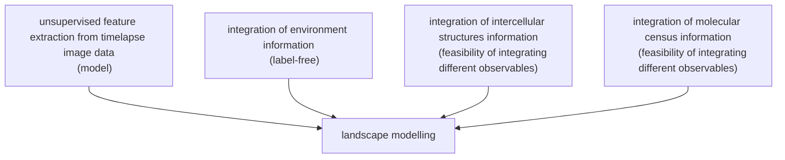

# cellsmap
Cellular state mapping for endos.

A minimal paper that achieves core proof-of-concept goals for the holistic state framework:



## Installation

This project requires Python 3.11.
We recommend using the most recent version of Python 3.11 (Python 3.11.12).
Package dependencies can be found in the `pyproject.toml` file.

### Installation using UV

We recommend using the Python package manager [uv](https://docs.astral.sh/uv) to manage dependencies and virtual environments.
Install uv following their [installation instructions](https://docs.astral.sh/uv/getting-started/installation/).

**1. Navigate to where you want to clone this repository**

```bash
cd /path/to/directory/
```

**2. Clone the repo from GitHub**

```bash
git clone git@github.com:aics-int/cellsmap.git
cd cellsmap
```

**3. Install the dependencies using uv**

For basic installation with just the core dependencies:

```bash
uv sync --no-dev
```

If you plan to develop code, you should also install the development dependencies:

```bash
uv sync
```

If you are on the Allen Institute for Cell Science local network, you can load on-prem data by installing `aicsfiles` (which is included in the optional `internal` dependency group):

```bash
uv sync --extra internal
```

**4. Activate the virtual environment**

Activate the virtual environment in the terminal:

For Windows:

```powershell
\path\to\venv\Scripts\activate
```

For Linux/Mac:

```bash
source /path/to/venv/bin/activate
```

You can deactivate the virtual environment using:

```
deactivate
```

### Alternative installation using `pip`

This project also includes a `requirements.txt` generated from the `uv.lock` file, which can be used to install requirements using `pip`.

> [!NOTE]
> This installation method will only install core dependencies.
> We recommend using uv to handle more complex installations of development and optional dependencies.

**1. Navigate to where you want to clone this repository**

```bash
cd /path/to/directory/
```

**2. Clone the repo from GitHub**

```bash
git clone git@github.com:aics-int/cellsmap.git
cd cellsmap
```

**3. Create and activate a new virtual environment**

```bash
python -m venv .venv
source .venv/bin/activate
```

**4. Install the dependencies using pip**

```bash
pip install -r requirements.txt
```

**5. Install the package**

```bash
pip install -e .
```

## Datasets
A catalog of the current datasets we have is [here](https://github.com/orgs/aics-int/projects/40).


## Workflows

<details open>
<summary> Serge </summary>

#### NOTE: WORKFLOWS ADAPTED TO NEW DATASET STRUCTURE (UNSTITCHED, FULL-DIMENSIONAL TIMELAPSES INSTEAD OF MONTAGE MIPS) AND ARE NOW FUNCTIONAL:
- [x] cdh5_classic_seg.py
- [x] cdh5_classic_seg_tracking.py
- [ ] cdh5_nodes_and_edges.py
- [ ] cdh5_nodes_and_edges_analysis.py

### Efforts
- get classic segmentations for all datasets using "Cdh5 classic segmentation" workflow
    - requires changing the function that builds the analysis queue to generalize to the new dataset types (fixed imaging data, Nikon data, etc.)
- run "label-free nuclei prediction" workflow on all timepoints of the 20X data
    - Nikon data processing delayed until converted to ome-zarr to avoid working with the original files
- apply tracking methods used for cell segmentations to the nuclei predictions
- test effectiveness of using nuclei as seed points in "Cdh5 classic segmentation" workflow
- try and improve segmentation consistency by using segmentations from multiple contiguous timepoints
- run "optical flow" workflow on more (all?) live datasets
    - requires building of an analysis queue function and multiprocessing
- test feasibility of label-free prediction of cells using a mode trained on the classic segmentations of cells

```mermaid

flowchart TD

subgraph three [optical flow]
wf3_fluor([VE-Cadherin 20X raw imaging data]) --> wf3_mip[generate MIP] --> wf3_optiflow[optical flow calculations] --random crops--> vecfield_results[[measurements:
    vector fields
    magnitudes of vectors
    angles relative to flow
]]
end

subgraph two [label-free nuclei prediction]
wf2_bf([brightfield 20X raw imaging data]) --> wf2_stdproj[generate standard deviation projections] --> wf2_labfree[label-free nuclei predictions] -.-> wf2_track[tracking nuclei] -.-> nuc_results_basic[[basic measurements:
    centroid positions
    centroid velocities
]]
end

subgraph one [Cdh5 classic segmentation]
wf1_fluor([VE-Cadherin 20X + 40X raw imaging data]) --> wf1_mip[generate MIPs] --> wf1_seg[generate cell segmentations] --> wf1_track[track cell segmentations] --> seg_results_basic[[basic measurements:
    centroid velocities
    cell elongation
    cell orientation
]]
wf1_track --> wf1c[represent boundaries of segmentations as nodes and edges]
--> results_adv[[advanced measurements:
    cell perimeters
    cell areas
    number of neighbors
    orientation of neighbors
    elongation of neighbors
    velocities of neighbors
    cell-cell edge lengths
    fluorescence intensities
]]
end

```




<details>
<summary>Classic Segmentation</summary>

### Purpose
Generates semantic segmentations of cells from maximum intensity projections of the VE-cadherin channel of the raw imaging data.
Processes all datasets in the `data_config.yaml` that were acquired on the 3i microscope by default.

### Usage
(`--N_PROC` can be changed to use fewer processes. Beware that this workflow requires a lot of memory if you use the default 30 processes.)
From the directory where you cloned cellsmap to:
```bash
cd cellsmap
uv run cellsmap/analyses/workflows/cdh5_classic_seg.py --N_PROC 30
uv run cellsmap/features/cdh5_classic_seg_tracking.py
uv run cellsmap/features/cdh5_nodes_and_edges.py --N_PROC 30
uv run cellsmap/features/cdh5_nodes_and_edges_concatenate_tables.py
uv run cellsmap/analyses/cdh5_ndoes_and_edges_analysis.py --N_PROC 30
```

### Descriptions
<details>
<summary>cdh5_classic_seg.py</summary>

#### Summary
Outputs segmentations of the Cdh5-GFP-expressing cells using a classical image segmentation approach. This step can be skipped if these already exist in `cellsmap/results/cdh5_classic_seg/`.

#### Options
- `--N_PROC 1` : How many processors to use (default is "1"). "1" can be replaced with any integer, memory permitting.
- `--SAVE_OUTPUT True` : Whether or not to save the output (default is True).
- `--IS_TEST False` : Whether or not to run a test (default is "False"). If "False" is changed to "True" then only the first timepoint will be evaluated and it will be saved in `tests/results/` instead of `cellsmap/results/`.
- `--VERBOSE False` : Whether to print out what the script is currently doing in detail (default is "False").

#### Inputs
1. All datasets found in the `data_config.yaml` file as unstitched images with their full Z-dimension.

#### Outputs
1. `cellsmap/results/cdh5_classic_seg/`: Classic segmentations based on timelapses of Cdh5-GFP. Each folder is a dataset name containing .ome.tiff files (1 file per timepoint).
</details>

<details>
<summary>cdh5_classic_seg_tracking.py</summary>

#### Summary
Tracks segmentations through time. Relabels segmentations such that their labels represent their track ID.

#### Options
- `--SAVE_OUTPUT True` : Whether or not to save the output (default is True).
- `--IS_TEST False` : Whether or not to run a test (default is "False"). If "False" is changed to "True" then only the first timepoint will be evaluated and it will be saved in `tests/results/` instead of `cellsmap/results/`.
- `--VERBOSE False` : Whether to print out what the script is currently doing in detail (default is "False").

#### Inputs
1. The outputs of `cellsmap/analyses/workflows/cdh5_classic_seg.py` (instance segmentations).

#### Outputs
1. `cellsmap/results/cdh5_classic_seg_tracking/[dataset_name]/tracked_images/`:
2. `cellsmap/results/cdh5_classic_seg_tracking/[dataset_name]/tracked_tables/`:
</details>

<details>
<summary>cdh5_nodes_and_edges.py</summary>

#### Summary
Outputs tables of measured features from the segmentation borders produced from Step 1 above and their raw Cdh5 dataset. This step can be skipped if these already exist in `cellsmap/results/cdh5_nodes_and_edges_analysis/`.

#### Options
- `--N_PROC 1` : How many processors to use (default is "1"). "1" can be replaced with any integer, memory permitting.
- `--SAVE_OUTPUT True` : Whether or not to save the output (default is True).
- `--IS_TEST False` : Whether or not to run a test (default is "False"). If "False" is changed to "True" then only the first timepoint will be evaluated and it will be saved in `tests/results/` instead of `cellsmap/results/`.
- `--VERBOSE False` : Whether to print out what the script is currently doing in detail (default is "False").

#### Inputs
1. The outputs from `cellsmap/features/cdh5_classic_seg_tracking.py` (instance segmentations).

#### Outputs
1. `cellsmap/results/cdh5_nodes_and_edges_analysis/[dataset_name]/tables/alignments/`: Tables from individual timepoints saved as .csv files of features measured from node-and-edge representations of the Cdh5 segmentations.

2. `cellsmap/results/cdh5_nodes_and_edges_analysis/[dataset_name]/[dataset_name]_alignments.csv`: Table of features measured from node-and-edge representations of the Cdh5 segmentations. A concatenation of the individual timepoint tables from "**1.**" into a single single .csv. Each row has a unique pair of nodes that define a line. The columns are described in the table below:

    | Column Name | Description | Units |
    |-------------|-------------|-------|
    | node_pair_labels | The labels of the nodes used to build a line with the order (origin_node, neighboring_node). | N/A |
    | node_pair_centroids | The centroids of the nodes used to build a line with the order (origin_node, neighboring_node). | N/A |
    | distances | The linear distance between node_pair_centroids. | N/A |
    | angles | The angle between the line formed by node_pair_centroids and a horizontal line. | Degrees |
    | edge_labels | The labels of the edges in that connect the paired nodes. | N/A |
    | edge_num_pixels | The number of pixels that constitute each edge. Does not account for differences in distance based on connectivity (but 'length (px)' does). | Pixels |
    | length (px) | The length of each edge in pixels (N.B. this does not include the distance from the node centroid to the first edge pixel). | Pixels |
    | fluor_mean (au) | The mean fluorescence of the raw Cdh5-GFP channel at an edge. Other measures for fluorescence include _std, _median, _min, _max, _pct25, and _pct75. | Arbitrary Units |

3. `cellsmap/results/cdh5_nodes_and_edges_analysis/[dataset_name]/tables/segmentation_properties/` : Tables from individual timepoints saved as .csv files of features measured from the Cdh5 segmentations.

4. `cellsmap/results/cdh5_nodes_and_edges_analysis/[dataset_name]/[dataset_name]_segprops.csv` : Table of features measured from the Cdh5 segmentations. A concatenation of the individual timepoint tables from "**3.**" into a single single .csv. Each row has a unique label of a segmented region. The columns are summarized below:

    | Column Name | Description | Units |
    |-------------|-------------|-------|
    | cell_label | The labels of the segmented regions. | N/A |
    | cell_centroid | The centroids of the segmented regions. | N/A |
    | cell_area (px**2) | The areas of the segmented regions. | Pixels Squared |
    | cell_perimeter (px) | The perimeters of the segmented regions. | Pixels |
    | cell_solidity | The solidities of the segmented regions. | N/A |
    | cell_eccentricity | The eccentricities of the segmented regions. | N/A |
    | cell_orientation | The orientations of the segmented regions. | Degrees |
    | cell_fluorescence_mean (au) | The mean fluorescence of the raw Cdh5-GFP channel for each segmented region. Other fluorescence measures include _std, _median, _min, _max, _pct25, and _pct75. | Arbitrary Units |
    | edge_labels | The labels of the edges that touch each segmented region. | N/A |
    | node_labels | The labels of the nodes that touch each segmented region. | N/A |
    | node_pair_labels | The labels of the node pairs that are at the end of each edge label that touches each segmented region. | N/A |


- **NOTE:** The "edge_labels", "node_labels", and "node_pair_labels" found in the tables output by `cdh5_nodes_and_edges.py` should all match / be consistent with each other.
</details>

<details>
<summary>cdh5_nodes_and_edges_concatenate_tables.py</summary>

#### Summary
Concatenates the tables output by `cdh5_nodes_and_edges.py` into a single large table.

#### Options

#### Inputs

#### Outputs

</details>

<details>
<summary>cdh5_nodes_and_edges_analysis.py</summary>

#### Summary
Outputs tables of measured features from the segmentation borders produced from Step 1 above and their raw Cdh5 dataset.

#### Options
- `--N_PROC 1` : How many processors to use (default is "1"). "1" can be replaced with any integer, memory permitting.
- `--SAVE_OUTPUT True` : Whether or not to save the output (default is True).
- `--SHOW_PLOTS True` : Whether or not to draw the plots (default is True). Showing plots may raise an error if executed on a command line interface-only machine, in which case this should be set to "False".

#### Inputs
1. The outputs from `cellsmap/features/cdh5_nodes_and_edges.py` (the "alignments" tables and the "segmentation_properties" tables).

#### Outputs
- `cellsmap/results/cdh5_nodes_and_edges_analysis` : Plots and summary tables of measured features.
</details>
&nbsp;
</details>


<details>
<summary>Label-free Nuclei Prediction</summary>

### Purpose
Generates semantic segmentations of nuclei from standard deviation projections of the raw brightfield channel.
Currently evaluates every 48th timeframe (i.e. every 4hrs) for all datasets in the `data_confg.yaml` that were acquired with the 3i microscope with a 20X magnification objective.
**NOTE** Tracking of nuclei has not been implemented yet.

### Usage
```bash
cd cellsmap
uv run cellsmap/analyses/nuclei_predictions/generate_label_free_nuc_pred.py
```
**NOTE** Tracking of nuclei has not been implemented yet.


### Description
<details>
<summary>generate_label_free_nuc_pred.py</summary>

#### Summary

[!NOTE]
**TO BE COMPLETED.**

Creates instance segmentations of nuclei from a standard deviation projection of the raw brightfield channel along the Z axis. A CellPose model was trained (by Goutham) on endothelial cell data (undocumented/unknown) and then re-trained on fixed-sample imaging data using a 20X objective where one channel was the brightfield standard deviation projection and the ground-truth was DAPI staining of nuclei (datasets: `20240328_T01_001` and `20240328_T02_001`)

#### Options
- `--n_proc 1` : How many processors to use (default is "1"). "1" can be replaced with any integer, memory permitting.
- `--save_output True` : Whether or not to save the output (default is True).
- `--overwrite False` : Whether or not to overwrite any existing outputs that this file produces. If False then timepoints where an output file already exists will be skipped (the user will be notified when skipping a file).
- `--is_test False` : Whether or not to run a test (default is "False"). If "False" is changed to "True" then only the first timepoint will be evaluated and it will be saved in `tests/results/` instead of `cellsmap/results/`.

#### Inputs
1. All datasets in the `data_config.yaml` acquired with a 20X objective using the 3i microscope.

#### Outputs
1. `cellsmap/results/generate_label_free_nuc_pred/[dataset_name]/[position_number]` : multichannel ome.tiff images where each image is a single timepoint and consists of 3 channels in this order: 1. a single plane of the brightfield channel that shows contrast, 2. the standard deviation projection of the brightfield channel along the Z axis, 3. the instance segmentations of the nuclei made by the CellPose model.

</details>
&nbsp;
</details>


<details>
<summary>Optical Flow</summary>

### Purpose
Generate a vector field from Cdh5 signal as a segmentation-independent measure of the velocity feature.
Currently runs on a single dataset as a proof-of-concept.

### Usage
```bash
cd cellsmap
uv run cellsmap/analyses/flow/flow_features.py
```

### Description
<details>
<summary>flow_features.py</summary>

[!IMPORTANT] **NEEDS TO BE RE-RUN ON A NEW DATASET THAT IS STILL INCLUDED IN THIS PROJECT**

[!NOTE] THIS DOCUMENTATION TO BE COMPLETED WHEN THE WORKFLOW HAS BEEN UPDATED.

#### Summary

#### Options

#### Inputs

#### Outputs

</details>
&nbsp;
</details>
