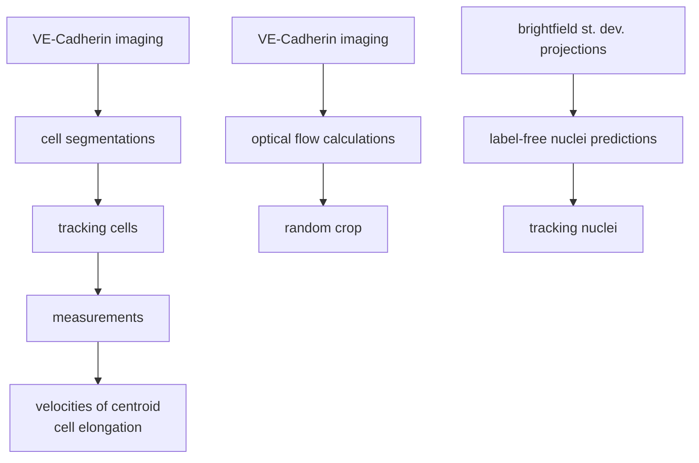

# cellsmap
cellular state mapping for endos


## Installation
```bash
pdm sync
```

## Datasets
A catalog of the current datasets we have is [here](https://github.com/orgs/aics-int/projects/40)


## Workflows



<details>
<summary>Measured features</summary>
filepath: somewhere
use case: publication (/ development)

description: blah blah

- cell segmentation
- cell tracking

- nuclei prediction
- nuclei tracking

- optical flow

</details>


### cellsmap/features/
The purpose of the `features` branch of `cellsmap` is to measure biologically-relevant features from timelapses of endothelial cells subjected to different fluid shear stresses (FSS) (colloquially called flow rates). High flow rates cause endothelial cells to align perpendicular to the FSS and low flow rates cause them to align parallel to the FSS, representing two visually conspicuous cell states (see https://doi.org/10.1002/cm.21652 for a review on the biology of flow sensing in endothelial cells).

Based on these observations, a (non-exhaustive) list of questions motivating this analysis includes:
- How do cell alignments change over time when FSS is changed?
- Are there other measurable cell-based features that correlate with changes in FSS?
- Can the dynamics of these features be combined with stochastic differential equations to describe cell-state transitions and a cell-state landscape? (see https://doi.org/10.1088/1478-3975/ac8c16)
- Do all cells change their state in the same way when flow is changed?
- Is the way that cells transition from a low flow to high flow state the reverse of the the change from a high flow to low flow state?


#### Installation
This workflow requires Python 3.10. Package dependencies can be found in the _pyproject.toml_ file. We use the Python package manager PDM in these instructions, but any virtual environment manager should do.
1. Clone the `cellsmap` repo from GitHub to your desired location.
2. Reconstruct the virtual environment.
    - if no _pdm.lock_ file exists in the cellsmap project folder (the same folder than this README is located in) then run `pdm lock` in your shell
    - when/if you have a _pdm.lock_ file then run `pdm sync` in your shell


#### Usage
1. Run `cdh5_classic_seg.py`. Outputs segmentations of the Cdh5-GFP-expressing cells using a classical image segmentation approach. This step can be skipped if these already exist in `cellsmap/results/cdh5_classic_seg/`.
    - Navigate to the `cellsmap/features/` folder in your shell
    - enter `pdm run cdh5_classic_seg.py`. One or more of the following arguments can be passed to this script by adding them at the end of this line of code.
        - `--N_PROC 1` : How many processors to use (default is "1"). "1" can be replaced with any integer, memory permitting.
        - `--SAVE_OUTPUT True` : Whether or not to save the output (default is True).
        - `--IS_TEST False` : Whether or not to run a test (default is "False"). If "False" is changed to "True" then only the first timepoint will be evaluated and it will be saved in `tests/results/` instead of `cellsmap/results/`.
        - `--VERBOSE False` : Whether to print out what the script is currently doing (default is "False").

2. Run `cdh5_nodes_and_edges.py`. Outputs tables of measured features from the segmentation borders produced from Step 1 above and their raw Cdh5 dataset. This step can be skipped if these already exist in `cellsmap/results/cdh5_nodes_and_edges_analysis/`.
    - Navigate to the `cellsmap/features/` folder in your shell
    - enter `pdm run cdh5_nodes_and_edges.py`. One or more of the following arguments can be passed to this script by adding them at the end of this line of code.
        - `--N_PROC 1` : How many processors to use (default is "1"). "1" can be replaced with any integer, memory permitting.
        - `--SAVE_OUTPUT True` : Whether or not to save the output (default is True).
        - `--IS_TEST False` : Whether or not to run a test (default is "False"). If "False" is changed to "True" then only the first timepoint will be evaluated and it will be saved in `tests/results/` instead of `cellsmap/results/`.
        - `--VERBOSE False` : Whether to print out what the script is currently doing (default is "False").

3. Run `cdh5_nodes_and_edges_analysis.py`. Outputs tables of measured features from the segmentation borders produced from Step 1 above and their raw Cdh5 dataset.
    - Navigate to the `cellsmap/features/` folder in your shell
    - enter `pdm run cdh5_nodes_and_edges.py`. One or more of the following arguments can be passed to this script by adding them at the end of this line of code.
        - `--N_PROC 1` : How many processors to use (default is "1"). "1" can be replaced with any integer, memory permitting.
        - `--SAVE_OUTPUT True` : Whether or not to save the output (default is True).
        - `--SHOW_PLOTS True` : Whether or not to draw the plots (default is True). Showing plots may raise an error if executed on a command line interface-only machine, in which case this should be set to "False".


#### Methods
`cdh5_classic_seg.py`
- **TODO:** Elaborate.

`cdh5_nodes_and_edges.py`

Cell edge alignment measurements are created using features/cdh5_nodes_and_edges.py from the raw cdh5 channel. It does so by 1. thresholding the cdh5-containing GFP channel, 2. skeletonizing this threshold, 3. sorting the skeleton into node and edge pixels, 4. connecting neighboring nodes with straight lines, 5. measuring the lengths of these straight lines and the angle that they make relative to a horizontal line (resulting in an angle between 0-90 where 0 = parallel to the horizontal flow of fluid and 90 = perpendicular to it).
This script outputs overlays of the raw images with the nodes, edges, and (rasterized versions of) the lines. It also outputs plots and tables for each timepoint that is analyzed as well as a master table with the tables of all the timepoints concatenated together.
- **TODO:** Revise.


#### Outputs
`cdh5_classic_seg.py`
1. `cellsmap/results/cdh5_classic_seg/` : Classic segmentations based on timelapses of Cdh5-GFP. Each folder is a dataset name containing .ome.tiff files (1 file per timepoint).
    - **TODO:** This folder currently has files that contain only the segmentations, however it might be better to include the multichannel files used for validation instead (which contain channels for the raw image, processed image, initial segmentation, final segmentation, and the segmentation borders), since some of these channels are loaded in cdh5_nodes_and_edges.py. **The only thing is that the size on disk of the segmentations-only folder is ~300MB while the size of the multichannel folder used for validation is ~20GB.**

`cdh5_nodes_and_edges.py`
1. `cellsmap/results/cdh5_nodes_and_edges_analysis/[dataset_name]/tables/alignments/` : Tables from individual timepoints saved as .csv files of features measured from node-and-edge representations of the Cdh5 segmentations.

2. `cellsmap/results/cdh5_nodes_and_edges_analysis/[dataset_name]/[dataset_name]_alignments.csv` : Table of features measured from node-and-edge representations of the Cdh5 segmentations. A concatenation of the individual timepoint tables from "**1.**" into a single single .csv. Each row has a unique pair of nodes that define a line. The columns are described in the table below:

    | Column Name | Description | Units |
    |-------------|-------------|-------|
    | node_pair_labels | The labels of the nodes used to build a line with the order (origin_node, neighboring_node). | N/A |
    | node_pair_centroids | The centroids of the nodes used to build a line with the order (origin_node, neighboring_node). | N/A |
    | distances | The linear distance between node_pair_centroids. | N/A |
    | angles | The angle between the line formed by node_pair_centroids and a horizontal line. | Degrees |
    | edge_labels | The labels of the edges in that connect the paired nodes. | N/A |
    | edge_num_pixels | The number of pixels that constitute each edge. Does not account for differences in distance based on connectivity (but 'length (px)' does). | Pixels |
    | length (px) | The length of each edge in pixels (N.B. this does not include the distance from the node centroid to the first edge pixel). | Pixels |
    | fluor_mean (au) | The mean fluorescence of the raw Cdh5-GFP channel at an edge. Other measures for fluorescence include _std, _median, _min, _max, _pct25, and _pct75. | Arbitrary Units |


3. `cellsmap/results/cdh5_nodes_and_edges_analysis/[dataset_name]/tables/segmentation_properties/` : Tables from individual timepoints saved as .csv files of features measured from the Cdh5 segmentations.

4. `cellsmap/results/cdh5_nodes_and_edges_analysis/[dataset_name]/[dataset_name]_segprops.csv` : Table of features measured from the Cdh5 segmentations. A concatenation of the individual timepoint tables from "**3.**" into a single single .csv. Each row has a unique label of a segmented region. The columns are summarized below:
    
    | Column Name | Description | Units |
    |-------------|-------------|-------|
    | cell_label | The labels of the segmented regions. | N/A |
    | cell_centroid | The centroids of the segmented regions. | N/A |
    | cell_area (px**2) | The areas of the segmented regions. | Pixels Squared |
    | cell_perimeter (px) | The perimeters of the segmented regions. | Pixels |
    | cell_solidity | The solidities of the segmented regions. | N/A |
    | cell_eccentricity | The eccentricities of the segmented regions. | N/A |
    | cell_orientation | The orientations of the segmented regions. | Degrees |
    | cell_fluorescence_mean (au) | The mean fluorescence of the raw Cdh5-GFP channel for each segmented region. Other fluorescence measures include _std, _median, _min, _max, _pct25, and _pct75. | Arbitrary Units |
    | edge_labels | The labels of the edges that touch each segmented region. | N/A |
    | node_labels | The labels of the nodes that touch each segmented region. | N/A |
    | node_pair_labels | The labels of the node pairs that are at the end of each edge label that touches each segmented region. | N/A |


- **NOTE:** The "edge_labels", "node_labels", and "node_pair_labels" found in the tables output by `cdh5_nodes_and_edges.py` should all match / be consistent with each other.


`cdh5_nodes_and_edges_analysis.py`
- `cellsmap/results/cdh5_nodes_and_edges_analysis` : Plots and summary tables of measured features.
    - **TODO:** Elaborate.

